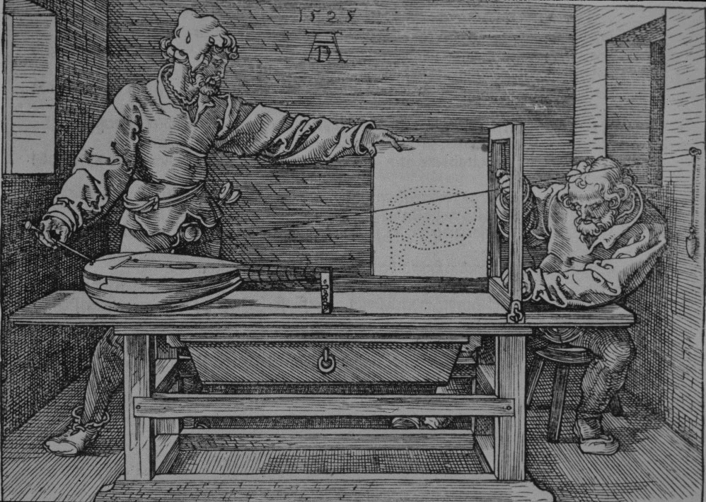
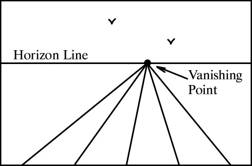
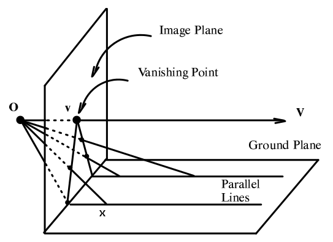

Hình học xạ ảnh ([projective geometry](http://en.wikipedia.org/wiki/Projective_geometry)) ám ảnh tôi trong suốt một thời gian dài. Đó là vào khoảng cuối năm 2011, khi mà OpenGL ES 2.0 trở nên thịnh hành trên những game cho thiết bị di động. Hệ điều hành iOS của Apple bắt đầu hỗ trợ OpenGL ES 2.0 từ iOS 5.0, còn phía Android là bắt đầu từ Android 2.2 (Froyo). Vì tính chất công việc, tôi bắt buộc phải cập nhật kiến thức để theo kịp công nghệ.

Điểm đặc biệt và quan trọng nhất ở OpenGL ES 2.0 chắc chắn là shader. Đây thực sự là một cuộc cách mạng của ngành đồ họa máy tính. Vì shader có thể lập trình được (programable), nó cung cấp cho chúng ta một cơ chế vô cùng linh hoạt và mạnh mẽ để quyết định màu của pixel (fragment) sẽ được vẽ ra màn hình. Đây là điều mà ở OpenGL ES 1.1 với fixed function không hề có. Và rất nhiều hiệu ứng đồ họa chỉ có thể làm được với shader mà thôi.

Tôi chú ý đến vertex shader, đoạn cuối của nó rất hay như này:

`gl_Position = a_position * u_projectionMatrix;`

Các position dĩ nhiên đều là tọa độ 3D, nhưng tại sao kiểu của chúng ở đây lại là vector 4D với 4 thành phần `(x, y, z, w)`? Thế và, vì chúng là vector 4D, nên ma trận projection cũng là ma trận 4x4 chứ không phải 3x3.

Một lời giải thích dễ dãi thường như sau: với mỗi tọa độ `(x, y, z)` của vật thể 3D, cứ thêm vào `w = 1`, ta có `(x, y, z, 1)`; xong truyền lên `a_position`, rồi nhân với `u_projectionMatrix` ra `gl_Position = (x0, y0, z0, w)` có `w` có thể khác 1, OpenGL ES sẽ tự động chuẩn hóa `gl_Position` bằng cách chia `x0, y0, z0` cho `w`; ta có tọa độ 3D quen thuộc `(x0/w, y0/w, z0/w)` là ảnh của `(x, y, z)` sau phép biến đổi projection.

Lời giải thích này ngầm chấp nhận `w` là hiển nhiên. Nhưng thực sự `w` là gì? Nó có vai trò gì? `w = 1` có gì đặc biệt? Với `w = 0` thì chuyện gì xảy ra (chia cho số 0)? Nếu `w = 0.5` thì sao?

Để có thể thỏa mãn những nỗi niềm trên, chúng ta cần phải tìm hiểu projective geometry.

## Đôi nét về lịch sử

Sự việc bắt đầu từ thời [Phục Hưng](http://vi.wikipedia.org/wiki/Ph%E1%BB%A5c_H%C6%B0ng) (thế kỷ 15) ở châu Âu, các họa sĩ lúc bấy giờ rất quan tâm đến việc làm sao để vẽ được một bức tranh trông như thật, tức là có perspective (nói cách khác là có chiều sâu). Là họa sĩ nhưng họ rất sẵn sàng "nghiên cứu khoa học" khi cần (thời xưa mà). Và hai trong số những họa sĩ tiêu biểu là [Alberti](http://en.wikipedia.org/wiki/Leon_Battista_Alberti) (1404-1472) và [Dürer](http://en.wikipedia.org/wiki/Albrecht_D%C3%BCrer) (1471-1528), họ nhận ra rằng để một bức tranh có perspective, thì những đường thẳng song song ngoài đời thực khi vào tranh sẽ phải hội tụ tại một điểm gọi là vanishing point (điểm triệt tiêu); tập hợp tất cả những vanishing point này gọi là horizon line (đường chân trời) nằm ở ngang mắt người xem.

Quy luật này được trình bày trong bài luận [Della Pictura](http://en.wikipedia.org/wiki/De_pictura) của Alberti, có lẽ là một trong những luận thuyết đầu tiên về projective geometry:

Những thế kỷ sau đó, các nhà toán học bắt tay vào nghiên cứu và xây dựng projective geometry một cách có hệ thống hơn. Đó là [Desargues](http://en.wikipedia.org/wiki/Girard_Desargues) (1591-1661), người đầu tiên giới thiệu khái niệm _điểm và đường thẳng ở vô tận_. Tiếp nối là công lao của các nhà toán học như Pascal, Carnot, Monge... đã hoàn thiện một hệ thống nền tảng vững chắc cho projective geometry.

## Hình học xạ ảnh là gì?

Trước hết chúng ta sẽ bàn về mặt phẳng xạ ảnh (projective plane).

Bạn đọc tinh ý sẽ nhận ra mặt phẳng xạ ảnh là mặt phẳng Euclid thêm vào những điểm ở vô tận và thêm một đường thẳng ở vô tận chứa hết những điểm vô tận ấy.

Để hiểu hơn về những thứ vô tận này, chúng ta hãy cũng nhìn về vô tận dọc theo một hướng trên một đường thẳng. Một cách trực giác, ta nhận ra là sẽ có một điểm ở vô cùng xa, xa lắm, nếu đi theo hướng đó mãi mãi. Vậy nếu đi theo hướng ngược lại thì sao? Ta sẽ có một điểm vô tận khác chăng? Câu trả lời là không! Cả hai điểm thực chất là một, tức là, tất cả những đường thẳng song song với nhau theo cùng một phương sẽ có chung một và chỉ một điểm vô tận mà thôi. Không khó để nhận ra điều này, hãy nhìn vào hình vẽ ở trên và tưởng tượng: khi đường thẳng `OX` xoay quanh trục `O`, `X` đi ra xa dần, và đi tới vô tận khi `OX` song song mặt đường; tiếp tục xoay, ta thấy: `X` bỗng đâu xuất hiện từ đầu bên kia của đường thẳng! Chứng tỏ hai điểm ở vô tận thực chất là một.

Cũng bằng trực giác, ta nhận ra những điểm vô tận này sẽ cùng nằm trên một đường thẳng, gọi là đường thẳng ở vô tận, bởi vì ảnh của chúng trên bức tranh cũng nằm trên một đường thẳng: horizon line. Có vẻ như sự thẳng hàng được bảo toàn? Chúng ta sẽ xem xét tính chất cực kỳ quan trọng này ở phần sau, khi nói về projective transformation.

## Hệ thống tiên đề

Với sự có mặt của điểm và đường thẳng ở vô tận, hai tiên đề căn bản của projective geometry được phát biểu rất tao nhã như sau:

* Qua hai điểm xác định duy nhất một đường thẳng.
* Qua hai đường thẳng xác định duy nhất một điểm.

Quá đẹp! Không còn trường hợp song song ngoại lệ rất khó chịu của hình học Euclid. Bạn đọc thử nhẩm trong đầu xem hai tiên đề này có đúng hay không.

Chưa hết đẹp! Trong các tiên đề / định lý của projective geometry, nếu ta hoán đổi "điểm" và "đường thẳng" thì tiên đề / định lý đó vẫn đúng. Tính chất này gọi là Duality.

Duality sẽ làm ta thắc mắc: vậy rốt cục điểm là gì, đường thẳng là gì? Phải chăng đó chỉ đơn thuần là tên gọi? Nếu ta xây dựng được một hệ thống tập hợp mà mỗi phần tử là Dog hoặc Cat, và thỏa mãn:

* Qua hai Dog xác định duy nhất một Cat.
* Qua hai Cat xác định duy nhất một Dog.

Thì hệ thống này cũng được gọi là projective geometry hỉ?

Câu trả lời là... ở phần sau.
