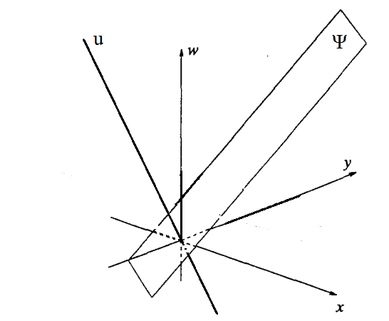
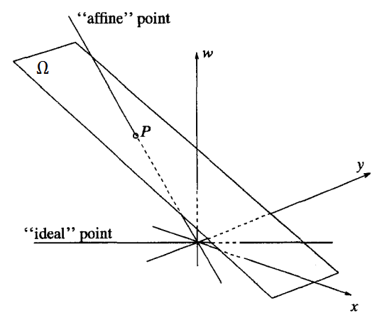
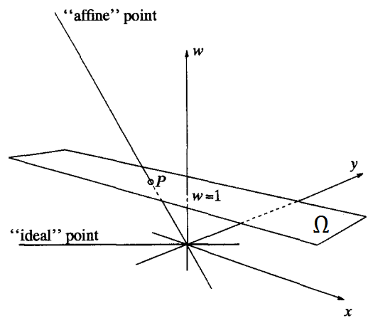

Ở [phần trước](../05-15-hinh-hoc-xa-anh-p1/), tôi đã hỏi bạn về hệ thống Dog Cat mà nếu thỏa mãn hai tiên đề căn bản, thì có được gọi là projective geometry hay không? Thực ra thì danh sách đầy đủ các tiên đề của projective geometry như sau:

<!--more-->

1. Qua hai điểm xác định duy nhất một đường thẳng.
2. Qua hai đường thẳng xác định duy nhất một điểm.
3. Mỗi đường thẳng chứa ít nhất 3 điểm.
4. Không có một đường thẳng nào chứa hết tất cả các điểm của mặt phẳng.

Dĩ nhiên, bất kể thứ gì trên đời bao gồm Dog Cat, nếu chúng thỏa mãn hệ thống tiên đề trên, thì đều gọi là projective geometry được. Bạn có thể hỏi: suy diễn như thế phỏng có ích gì? Đang hình dung điểm, đường thẳng rất quen thuộc, sao phải chuyển sang Dog Cat? Tất nhiên là tôi có lý do rồi.

## Hệ tọa độ đồng nhất (homogeneous coordination)

Chắc không cần phải nói nhiều về tầm quan trọng của tọa độ. Bây giờ chúng ta phải tìm một cách nào đó để gán tọa độ số thực cho các điểm trong mặt phẳng xạ ảnh.

Đối với những điểm bình thường (không phải vô tận) thì chỉ việc dùng hai số thực $(x, y)$ như mọi khi. Nhưng với những điểm ở vô tận thì không có cách gì gán tọa độ cho chúng được.

Rõ ràng, nếu chúng ta cứ hình dung mặt phẳng xạ ảnh là mặt phẳng Euclide thêm điểm và đường thẳng ở vô tận thì không làm sao gán tọa độ cho tất cả các điểm được. Ước gì có một cách hình dung khác, mà ở đó, không có sự phân biệt giữa vô tận và bình thường.

Và đây là cách hình dung chúng ta đang mong muốn:

Xét hệ tọa độ không gian 3 chiều $Oxyw$ như hình vẽ, chúng ta hãy hình dung:

- Mỗi một ĐIỂM xạ ảnh là một đường thẳng Euclide đi qua gốc tọa độ ($u$ trong hình vẽ).
- Mỗi một ĐƯỜNG THẲNG xạ ảnh là một mặt phẳng Euclide đi qua gốc tọa độ ($\Psi$ trong hình vẽ).

Dễ thấy khái niệm ĐIỂM và ĐƯỜNG THẲNG này thỏa mãn hệ thống tiên đề, và không tồn tại ĐIỂM và ĐƯỜNG THẲNG nào gọi là ở vô tận. Vậy cách hình dung của chúng ta là đúng đắn.

Với cách hình dung này, việc gán tọa độ cho ĐIỂM rất dễ dàng: nó là bộ 3 số $(x, y, w)$. Vì ĐIỂM là đường thẳng Euclide đi qua gốc tọa độ, nó sẽ được biểu diễn bởi $(x, y, w)$, đó chính là đường thẳng nối gốc tọa độ với $(x, y, w)$. Chúng ta có hai nhận xét hiển nhiên sau:

- Không có ĐIỂM nào có tọa độ $(x, y, w) = (0, 0, 0)$. `(1)`
- Các tọa độ $(x, y, w)$ và $(kx, ky, kw)$ $\forall$ $k \ne 0$ cùng biểu diễn một ĐIỂM. `(2)`

Lập luận tương tự, ĐƯỜNG THẲNG cũng sẽ được biểu diễn bởi bộ 3 số $(a, b, c)$. Một ĐIỂM $(x, y, w)$ gọi là nằm trên một ĐƯỜNG THẲNG $(a, b, c)$ khi và chỉ khi: $ax + by + cw = 0$. Hai nhận xét `(1)` và `(2)` đương nhiên cũng đúng với ĐƯỜNG THẲNG. Quả đúng là Duality rồi.

Tóm lại, trong mặt phẳng xạ ảnh, mỗi ĐIỂM và ĐƯỜNG THẲNG được biển diễn bởi tọa độ $(x, y, w)$. Nếu nhân tọa độ đó với một số khác $0$ thì được một tọa độ mới nhưng vẫn biểu diễn ĐIỂM / ĐƯỜNG THẲNG đó. Tọa độ $(0, 0, 0)$ không biểu diễn cho bất cứ ĐIỂM hay ĐƯỜNG THẲNG nào. Hệ tọa độ này gọi là hệ tọa độ đồng nhất.

## Nhúng mặt phẳng Euclide vào thế giới ĐIỂM / ĐƯỜNG THẲNG

Trong thế giới ĐIỂM / ĐƯỜNG THẲNG, giả sử tôi cho bạn 3 ĐIỂM có tọa độ $(18, 31, 44)$, $(446, 2478, 9837)$, và $(122436, 4579900, 80)$ bạn hãy hình dung mối tương quan giữa 3 điểm này. Tôi không biết phải giải thích "mối tương quan" là sao, nhưng có thể kể ví dụ như: "ồ, 3 điểm này có tạo thành một tam giác đều/vuông/cân không nhỉ" hay "ối, sao hai điểm này nằm gần nhau vậy mà điểm kia lại nằm xa tít". Với 3 cái tọa độ choáng ngợp như trên, bạn hình dung thế nào?

Hình như trong thâm tâm bạn vẫn còn lưu luyến mặt phẳng Euclide với hệ tọa độ $Oxy$ quá đỗi thân thương và quen thuộc. Bạn thừa nhận, đúng, tọa độ Euclide là cực kỳ tự nhiên -- so natural, ví dụ cho hai điểm $(10, 11)$ và $(11, 12)$ là biết ngay chúng ở rất gần nhau. Bạn đang khao khát "convert" ĐIỂM sang điểm.

Vậy thì hãy nhúng ngay một mặt phẳng Euclide vào thế giới ĐIỂM / ĐƯỜNG THẲNG, như hình vẽ dưới đây:

Mặt phẳng $\Omega$ (không đi qua gốc tọa độ) đã được nhúng vào. Ta thấy:

- Mỗi một ĐIỂM mà không song song với $\Omega$ thì luôn có đúng một điểm tương ứng thuộc $\Omega$, nó là giao điểm giữa ĐIỂM đó với $\Omega$ (như $P$ trong hình vẽ).
- Mỗi một điểm thuộc $\Omega$ luôn có đúng một ĐIỂM tương ứng.
- Tất cả những ĐIỂM thuộc cái ĐƯỜNG THẲNG song song với $\Omega$, sẽ không có điểm tương ứng thuộc $\Omega$.

Mặt phẳng $\Omega$ đóng vai trò tham khảo cho các ĐIỂM, mỗi khi bạn muốn "convert" một ĐIỂM sang điểm, chỉ cần tìm giao của ĐIỂM đó với $\Omega$. Trường hợp ĐIỂM đó không giao với $\Omega$, thì ĐIỂM đó được convert sang một điểm ở vô tận nằm trên $\Omega$. Chú ý rằng, về mặt tổng quát thì không có khái niệm ĐIỂM ở vô tận, nhưng với một cách chọn mặt phẳng $\Omega$ cụ thể như trên thì tồn tại những ĐIỂM được coi là ở vô tận. Xin nhắc lại, với một cách chọn mặt phẳng $\Omega$ cụ thể.

Mặt phẳng $\Omega$ được chọn nằm xiên xiên nhưng trong hình vẽ trên thật không khéo tí nào, vì:

- Tìm giao giữa ĐIỂM và $\Omega$ khá là vất vả.
- Tìm được rồi, lại phải tính toán để bỏ bớt một thành phần tọa độ.

Khéo nhất là nên chọn mặt phẳng $w = 1$ làm $\Omega$ như này:

Bây giờ thì:

- Giao giữa ĐIỂM $(x, y, w)$ với $\Omega$ chính là $(x/w, y/w, 1)$ ($P$ trong hình vẽ).
- Bỏ luôn $1$ để được ngay $(x/w, y/w)$ là tọa độ Euclide của ĐIỂM sau khi được convert sang $\Omega$.

Với cách chọn $\Omega$ này, ĐIỂM $(x, y, w)$ với $w = 0$ ngầm báo hiệu nó ở vô tận sau khi được convert sang $\Omega$. Từ giờ trở đi, nếu ta thấy ĐIỂM nào có $w = 0$ thì có thể nói nó ở vô tận. Một bài tập nhỏ cho bạn đọc: ĐƯỜNG THẲNG ở vô tận có tọa độ là bao nhiêu?

Ở chiều ngược lại, tất cả những điểm $(x, y)$ thuộc mặt phẳng Euclide $\Omega$ muốn convert sang mặt phẳng xạ ảnh, thì chỉ cần thêm số $1$ vào cuối để có ĐIỂM $(x, y, 1)$.

Như vậy là chúng ta đã áp đặt được một hệ tọa độ gọi là hệ tọa độ đồng nhất vào mặt phẳng xạ ảnh, và nhúng được một hệ tọa độ Euclide $\Omega$ vào trong nó. Trong [phần tới](../05-19-hinh-hoc-xa-anh-p3/) chúng ra sẽ tìm hiểu về các phép biến hình (transformation) trong mặt phẳng xạ ảnh.
