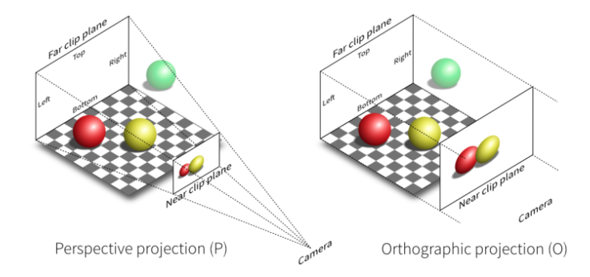
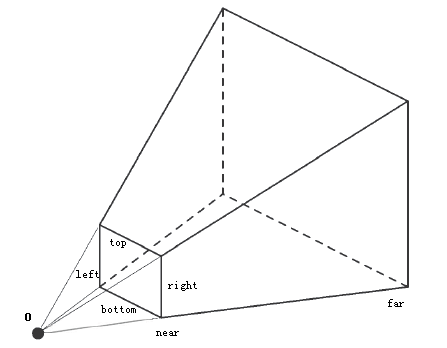

Trong [phần trước](../05-17-hinh-hoc-xa-anh-p2/) chúng ta đã tìm hiểu về hệ tọa độ đồng nhất. Trong phần này, trước khi đi vào các phép biến đổi, chúng ta sẽ nói một chút về không gian xạ ảnh (projective space).

<!--more-->

## Không gian xạ ảnh

Không gian xạ ảnh là một tập hợp gồm nhiều mặt phẳng xạ ảnh. Không gian này có những tính chất sau:

- Qua hai mặt phẳng xác định duy nhất một đường thẳng.
- Hai mặt phẳng song song có chung một đường thẳng ở vô tận.
- Tất cả các điểm ở vô tận -- cũng tức là tất cả các đường thẳng ở vô tận -- cùng nằm trên một mặt phẳng gọi là mặt phẳng ở vô tận.

Mỗi điểm trong không gian sẽ có tọa độ $(x, y, z, w)$. Tương tự như trong mặt phẳng xạ ảnh, $w = 0$ ám chỉ điểm ở vô tận theo hướng $(x, y, z)$; còn với $w = 1$ thì $(x, y, z)$ là tọa độ điểm tương ứng trong không gian 3D Euclide.

## Các phép biến đổi (transformation)

Một trong những cách để phân biệt các thể loại hình học là những phép biến đổi và các tính chất được bảo toàn sau những phép biến đổi đó:

- [Hình học Euclide](http://en.wikipedia.org/wiki/Euclidean_geometry) có các phép translation và rotation; gọi chung là Euclide transformation. Góc và độ dài (khoảng cách) được bảo toàn.
- [Hình học affine](http://en.wikipedia.org/wiki/Affine_geometry) tổng quát hơn hình học Euclide, nó có thêm các phép scaling và shearing; gọi chung là affine transfomation. Sự song song được bảo toàn.
- [Hình học xạ ảnh](http://en.wikipedia.org/wiki/Projective_geometry) tổng quát hơn hình học affine, nó có thêm phép projective; gọi chung là projective transformation. Sự thẳng hàng được bảo toàn.

Bây giờ chúng ta sẽ xem xét từng phép biến đổi: translation, rotation, scaling, shearing và projective trong hình học xạ ảnh. Chú ý rằng tất cả những phép này đều có thể gọi chung là projective được vì sự thẳng hàng đều được bảo toàn.

## Translation

Rất khó hình dung translation trong mặt phẳng xạ ảnh nếu không có mặt phẳng nhúng $\Omega$ (xem [phần 2](../05-17-hinh-hoc-xa-anh-p2/)). Phép translation $(a, b)$ sẽ biến đổi một điểm $(x, y, w)$ như sau:

$(x, y, w) \mapsto (x/w, y/w, 1) \mapsto (x/w + a, y/w + b, 1) \mapsto (x + aw, y + bw, w)$

Rút gọn là: $(x, y, w) \mapsto (x + aw, y + bw, w)$; công thức rút gọn này có thể áp dụng với $w = 0$; như vậy translation không làm thay đổi những điểm ở vô tận $(w = 0)$.

Điều thú vị là khi dùng ma trận để biểu diễn phép translation $(a, b)$, trong hình học Euclide cũng như affine không tồn tại ma trận $2 \times 2$ nào để biến một điểm $(x, y)$ thành $(x + a, y + b)$. Ví dụ gốc tọa độ $(0, 0)$ nhân với bất kỳ ma trận $2 \times 2$ nào cũng vẫn là chính nó $(0, 0)$; trong khi đó phép translation sẽ biến đổi tất cả các điểm bao gồm cả gốc tọa độ.

Và đây lại là một ưu điểm nữa của hình học xạ ảnh, dùng ma trận $3 \times 3$ sẽ biểu diễn được phép translation $(a, b)$ trên mặt phẳng xạ ảnh, ma trận này như sau:

$$\begin{pmatrix}
1 & 0 & a \\\\
0 & 1 & b \\\\
0 & 0 & 1
\end{pmatrix}$$

Tương tự như thế cho không gian xạ ảnh, mỗi điểm $(x, y, z, w)$ qua phép translation $(a, b, c)$ sẽ biến thành $(x + aw, y + bw, z + cw, w)$ nhờ nhân với ma trận:

$$\begin{pmatrix}
1 & 0 & 0 & a \\\\
0 & 1 & 0 & b \\\\
0 & 0 & 1 & c \\\\
0 & 0 & 0 & 1
\end{pmatrix}$$

## Rotation, scaling và shearing

Đối với những phép này trong mặt phẳng xạ ảnh, chúng ta có thể sử dụng lại y chang ma trận $2 \times 2$ trong hình học Euclide và affine, chỉ thêm vào một dòng và một cột đơn giản để được ma trận $3 \times 3$ như sau:

$$\begin{pmatrix}
a & b & 0 \\\\
c & d & 0 \\\\
0 & 0 & 1
\end{pmatrix}$$

Tương tự cho không gian xạ ảnh.

Điều giống nhau ở các phép translation, rotation, scaling và shearing là chúng không làm thay đổi $w$, tức là những điểm bình thường vẫn bình thường, những điểm ở vô tận vẫn ở vô tận. Những phép này đều gọi chung là affine transformation.

## Projective tranformation

Đây là chủ đề chính của chúng ta, phép biến đổi projective hoàn toàn có thể thay đổi $w$, nghĩa là có khả năng biến một điểm bình thường tới vô tận và ngược lại.


Phép biến đổi projective là một song ánh (one-to-one mapping) biến điểm thành điểm, và bảo toàn sự thẳng hàng.


Do sự thẳng hàng được bảo toàn, nên phép biến đổi projective sẽ biến đường thẳng thành đường thẳng, và mặt phẳng thành mặt phẳng.

Ngoài ra còn những tính chất khác được bảo toàn là division ratio (với affine transformation) và [cross ratio](http://en.wikipedia.org/wiki/Cross-ratio) (với projective transformation) nhưng tôi sẽ không đi sâu vào những tính chất này.

Ta có 2 định lý sau đây:


Mọi phép projective trong mặt phẳng xạ ảnh đều có thể biểu diễn bởi một ma trận khả nghịch $3 \times 3$, và ma trận này là duy nhất. Chú ý: hai ma trận $A$, $B$ được gọi là giống nhau nếu tồn tại một số thực $k \ne 0$ sao cho $B = kA$ (hiển nhiên).



Trên cùng một mặt phẳng xạ ảnh, nếu ta xác định được tọa độ 4 điểm bất kỳ $(A, B, C, D)$ trong đó không có 3 điểm nào thẳng hàng, và cũng xác định được tọa độ 4 điểm ảnh của chúng $(A', B', C', D')$ qua một phép projective; thì phép projective đó là duy nhất. Nói cách khác là không có hai phép projective nào cùng biến $(A, B, C, D)$ thành $(A', B', C', D')$.


Việc chứng minh hai định lý trên nằm ngoài phạm vi bài viết này. Bạn đọc có thể tham khảo ở những [tài liệu khác](http://www.amazon.com/Projective-Geometry-Applications-Computer-Graphics/dp/0137306490).

Hai định lý trên có thể mở rộng cho không gian xạ ảnh. Ở định lý 1, lúc này ta cần một ma trận $4 \times 4$ để biểu diễn phép projective. Ở định lý 2, ta cần xác định 5 điểm trong đó không có 4 điểm nào đồng phẳng, cùng với 5 điểm ảnh của chúng.

## Những thuật ngữ dễ gây nhầm lẫn

Khi làm việc với đồ họa 3D, chúng ta rất hay nghe những thuật ngữ như:

- central projection
- perspective projection
- perspective transformation
- ortho projection
- ortho transformation
- projective transformation

Phân biệt chúng như thế nào?

Trước hết, theo [wikipedia](http://en.wikipedia.org/wiki/3D_projection), projection luôn là phép biến đổi từ nhiều chiều xuống ít chiều hơn. Ví dụ: projection biến đổi một vật thể 3D thành một hình phẳng trên một mặt phẳng 2D.

Central projection (phép chiếu xuyên tâm) và perspective projection (phép chiếu phối cảnh) là một. Ở phép projection này có một điểm trung tâm, từ đó phát ra các đường thẳng cắt các điểm trên vật thể 3D và sẽ cắt mặt phẳng 2D tại những điểm ảnh cần tìm.

Còn đối với ortho projection (phép chiếu song song) thì không có điểm trung tâm mà chỉ có những đường thẳng song song cùng đi theo một hướng nào đó, chúng cắt các điểm trên vật thể 3D và sẽ cắt mặt phẳng 2D tại những điểm ảnh cần tìm.

Có thể nói ở ortho projection, vẫn có điểm trung tâm nhưng điểm này nằm ở vô tận, do đó những đường thẳng phát ra từ nó sẽ song song với nhau. Trong ortho projection, tính song song vẫn được bảo toàn, vật thể không bị méo (biến dạng). Còn perspective projection thì ngược lại, tính song song không được bảo toàn, và vật thể sẽ bị méo.

Các phép projection không được gọi là projective transfomation vì chúng không phải là one-to-one mapping và cũng không bảo toàn tính thẳng hàng.

Tuy nhiên, perspective transformation và ortho transformation thì đích thị là những projective transfomation. Thực ra hai phép này là một, vì hình học xạ ảnh đối xử điểm bình thường và vô tận như nhau, cho nên điểm trung tâm dù ở vị trí bình thường (perspective) hay là ở vị trí vô tận (ortho) thì cũng không có gì khác nhau. Perspective/ortho transformation chỉ có thể biến một mặt phẳng này thành một mặt phẳng khác, chứ không thể biến nguyên một khối 3D (gồm nhiều mặt phẳng) lên một mặt phẳng khác như projection.

Perspective/ortho transformation là một trường hợp đặc biệt của projective transfomation: tất cả những đường thẳng đi qua điểm $A$ và điểm ảnh $A'$ của nó đều đồng quy tại một điểm (điểm trung tâm).


Mọi projective transformation đều có thể phân rã thành một số hữu hạn các phép perspective/ortho transformation.


Một lần nữa, chứng minh của định lý này nằm ngoài phạm vi bài viết. Việc nêu ra nó chỉ mang tính chất tham khảo và không có ứng dụng gì nhiều vào OpenGL ES 2.0.

## Trở lại OpenGL ES 2.0

Mục tiêu tối thượng của đồ họa 3D luôn là chiếu một vật thể 3D lên một mặt phẳng 2D.

Chúng ta không thể dùng các phép projection vì chúng làm mất đi thông tin về chiều sâu. Cũng không thể dùng các phép perspective/ortho transformation vì chúng không chiếu nguyên vật thể 3D lên mặt phẳng 2D.

Phương pháp mà OpenGL ES 2.0 sử dụng khá đặc biệt, trước hết nó sẽ áp dụng một phép biến đổi projective mà:

- Biến điểm trung tâm về một điểm ở vô tận, có tọa độ $(x, y, z, w) = (0, 0, 1, 0)$ tức là những đường thẳng phát ra từ nó tới vật thể sẽ song song với nhau và song song với trục $Oz$.
- Biến hình chóp cụt (frustum, xem hình vẽ bên dưới) thành hình lập phương đơn vị có các tọa độ từ $(-1, -1, -1)$ tới $(1, 1, 1)$.

Đây quả thực là một phép biến đổi projective rất tổng quát, nó bao gồm cả translation, rotation, scaling, shearing và projective.

Giờ thì mọi việc trở nên đơn giản hơn nhiều, với mỗi tọa độ $(x, y, z, w)$ thu được:

- Nếu $w \ne 0$ thì $(x/w, y/w)$ là toạ độ 2D của điểm này trên mặt phẳng chiếu 2D; còn $z/w$ là độ sâu của điểm, sẽ được lưu vào depth buffer và dùng cho depth test. Chú ý: OpenGL ES sẽ tiếp tục biến đổi theo tỷ lệ những con số $(x/w, y/w, z/w)$ này, tùy thuộc vào những giá trị mà chúng ta đã truyền vào `glViewport()` và `glDepthRange()`.
- Nếu $w = 0$ thì đây được coi là điểm ở vô tận theo hướng $(x, y, z)$, tức là nằm ra ngoài hình lập phương đơn vị. Đối với tất cả những điểm nằm ngoài hình lập phương đơn vị (cho dù $w = 0$ hay $w \ne 0$), OpenGL ES sẽ phải tốn công sức để cắt xén (clip) và tạo ra những điểm mới nằm trên biên và bề mặt của hình lập phương; những điểm mới này dĩ nhiên có $w \ne 0$ và được đối xử như trường hợp trên.

Còn một điều lăn tăn nho nhỏ trong phương pháp trên, đó là: sau khi tìm được tọa độ $(x, y)$ trên mặt phẳng $z = -1$, tại sao chúng ta không biến đổi ngược lại để có tọa độ $(x, y)$ trên mặt phẳng ban đầu $z = -near$? Mục tiêu của chúng ta là tìm tọa độ trên mặt phẳng $z = -near$ mà. Thực ra, mục tiêu cuối cùng không quan tâm đến tọa độ $(x, y)$ tìm được trên mặt phẳng nào, mà là tọa độ $(x, y)$ đã được scale theo tỷ lệ từ hình chữ nhật $(left, right, top, bottom)$ sang hình vuông $(-1, -1, 1, 1)$. Vậy ta cần chứng minh tỷ lệ của tọa độ $(x, y)$ trong hình chữ nhật $(left, right, top, bottom)$ bằng với tỷ lệ của tọa độ $(x', y')$ trong hình vuông $(-1, -1, 1, 1)$, trong đó $(x', y')$ là ảnh của $(x, y)$ sau phép biến đổi projective mô tả ở trên. Có hai cách chứng minh:

1. Dùng đại số, ta cần thiết lập ma trận biến đổi và hoàn toàn dựa vào các con số để tính toán.
2. Dùng hình học, ta cần sử dụng cross ratio. Nhắc lại là, ngoài sự thẳng hàng ra, cross ratio cũng được bảo toàn sau phép biến đổi projective.

Nếu theo cách 1, để tìm ra ma trận biến đổi $(4\times4)$ ta sẽ sử dụng định lý 2 đã nêu ở trên, cho không gian xạ ảnh. Tức là phải chọn ra 5 điểm trước và 5 điểm sau của phép biến đổi (chú ý là trong số 5 điểm trước không được có 4 điểm nào đồng phẳng). Ví dụ ta có thể chọn 5 điểm trước là: điểm trung tâm, 2 điểm phía trên của mặt phẳng $z = -near$, 2 điểm phía dưới của mặt phẳng $z = -far$. Lần lượt áp dụng chúng vào các phép nhân điểm với ma trận, và giải hệ phương trình. Ví dụ, với phép perspective, phép này biến điểm trung tâm $(0, 0, 0, 1)$ thành $(0, 0, 1, 0)$, ta có ma trận biến đổi là:

$$\begin{pmatrix}
\frac{2n}{r-l} &                 0 &    \frac{r+l}{r-l} &                   0 \\\\
             0 &    \frac{2n}{t-b} &    \frac{t+b}{t-b} &                   0 \\\\
             0 &                 0 & \frac{-(f+n)}{f-n} &    \frac{-2fn}{f-n} \\\\
             0 &                 0 &                 -1 &                   0
\end{pmatrix}$$

Trong đó $l, r, t, b, n, f$ lần lượt là viết tắt của $left, right, top, bottom, near, far$.

Nếu theo cách 2, thì chỉ cần dùng suy luận logic, định lý Thales và sự bảo toàn của tính thẳng hàng và cross ratio. Chứng minh cụ thể xin được dành cho bạn đọc.
