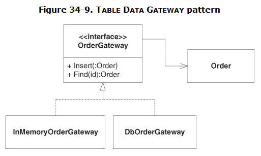
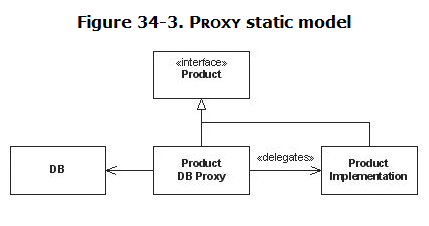
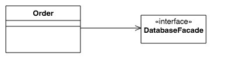

Object persistence -- for example, saving/loading objects to/from a database -- is easy, especially when using an ORM framework. It is easy because it breaks principles of OO design.

>When objects are used as data structures it is a design smell; and it always has been. When tools like Hibernate call themselves object-relational mappers, they are incorrect. ORMs don't map relational data to objects; they map relational data to data structures. Those data structures are not objects.  
--- Uncle Bob in [OO vs FP](http://blog.cleancoder.com/uncle-bob/2014/11/24/FPvsOO.html)

Frankly, object persistence is hard because we need to pursuit both of the two principles:

1. Encapsulation: objects must not expose their internal states.
2. Separation of concerns: objects must not be aware (directly/indirectly) about the persistence mechanism.

Now we will discuss some typical patterns when dealing with object persistence, and see how they can satisfy only one of the two principles above.

## Table Data Gateway (aka Data Access Objects — DAO)

This pattern is simple and can be described in the diagram below:

Clearly, Table Data Gateway breaks the principle #1. The method `Insert` needs to access the internal state of the object `Order` so it can write the state to database. This makes a bunch of getter methods for `Order`. Moreover, the method `Find` has to know how to construct an `Order` object from the loaded data. This also makes a bunch of setter methods and/or unnecessary complex constructors for the class `Order`.

Another problem `(*)` of this pattern is that sometimes we don't know how much of data should be loaded for an object `Order`. So we usually load all. What if the object has a relationship with other objects? For example, the object `Order` may keep a list of products that belong to this order. Should we load these products too? What if these products also have their own relationships? And so on.

## Proxy

This pattern still breaks the principle #1 as the `ProductDBProxy` needs to construct/save the `ProductImplementation` through constructors and setter/getter methods.

However, the problem `(*)` can be solved. Though a proxy is basically a gateway, but unlike the gateway, which doesn't know how much data should be loaded, the proxy does, simply because in the context of one of its methods, the proxy knows which data are needed.

## Database-speaking Object

The pattern accepts breaking the principle #2. Each object holds a reference to a facade to the database and delegate all persistence stuff to this facade. The pattern solves the problem `(*)` nicely since each object by itself can actively load/save its data. I consider Memento pattern is similar to this pattern.

## What should we choose?

I always prefer the Table Data Gateway pattern because of its simplicity. Sometimes exposing internal states is not too bad. As we know, exposing internal states is evil because those states are implementation details, thus they are unstable and do cause annoyance to their clients. However, in this case, there is only one client consuming the extra getter/setter/constructor methods -- the gateway. Hence the annoyance is mitigated.

To cope with the problem `(*)`, the gateway may create multiple versions of the objects with various level of filled data, depending on the (fixed) demands of its clients. But when those demands are not known, the Proxy pattern can be applied. Care should be taken as this pattern is very complex.

One simpler way to solve problem `(*)` is using the Database-speaking Object pattern, with the cost of breaking the principle #2. So you have to sustain the indirect dependency of your objects upon persistence-related APIs. In the future, it will be difficult to reuse your objects in another context which doesn't care about persistence. But will you?
