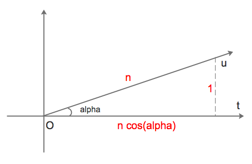
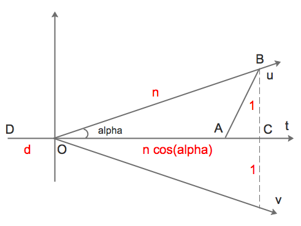

Một bài cực khó của kì thi Toán quốc tế (IMO) 2017 diễn ra tại Rio de Janeiro vào tháng 7 vừa qua. Theo quan sát của một thanh niên an nam thì chỉ có duy nhất một [thanh niên nga ngố](https://www.imo-official.org/team_r.aspx?code=RUS&year=2017) tên là Mikhail Ivanov giải trọn vẹn bài này trong phòng thi. Thanh niên an nam cũng cố giải, nhưng trong một phòng khác.

<!--more-->

## Đề bài

Một cô thợ săn và một con thỏ tàng hình chơi trò chơi sau trên mặt phẳng. Điểm xuất phát $A_0$ của con thỏ và điểm xuất phát $B_0$ của cô thợ săn trùng nhau. Sau $n-1$ lượt chơi, con thỏ ở điểm $A_{n-1}$ và cô thợ săn ở điểm $B_{n-1}$. Ở lượt chơi thứ $n$, có ba điều lần lượt xảy ra theo thứ tự dưới đây:

1. Con thỏ di chuyển một cách không quan sát được tới điểm $A_n$ sao cho khoảng cách giữa $A_{n-1}$ và $A_n$ bằng đúng $1$.
2. Một thiết bị định vị thông báo cho cô thợ săn về một điểm $P_n$, đảm bảo khoảng cách giữa $P_n$ và $A_n$ không lớn hơn $1$.
3. Cô thợ săn di chuyển một cách quan sát được tới điểm $B_n$ sao cho khoảng cách giữa $B_{n-1}$ và $B_n$ bằng đúng $1$.

Hỏi điều sau đây sai hay đúng: cho dù con thỏ có di chuyển như thế nào và các điểm được thiết bị định vị thông báo có là những điểm nào, cô thợ săn luôn có thể chọn cho mình cách di chuyển sao cho sau $10^9$ lượt chơi, cô ta có thể khẳng định chắc chắn rằng khoảng cách giữa mình và con thỏ không vượt quá $100$?

## Lời giải thử

Câu trả lời là không! Cô thợ săn không thể nào chọn được một cách di chuyển như vậy.

Để chứng minh, chúng ta giả sử rằng con thỏ nắm quyền điểu khiển máy định vị. Sau đó ta sẽ bày cho thỏ một cách "dụ" cô thợ săn sao cho khoảng cách giữa nó và cô thợ săn sẽ tăng dần, và đạt hơn $100$ sau $10^9$ lượt chơi.

Tạm đặt $n$ là một số nguyên dương và $\alpha$ là một góc sao cho $sin\alpha = 1/n$. Thỏ sẽ chơi như sau.

Trong $n$ lượt chơi đầu tiên, thỏ di chuyển đều theo một tia thẳng $u$ bất kì, cụ thể tại lượt thứ $i$ $(i=1..n)$ thì nó nhảy đến một vị trí cách điểm ban đầu một khoảng là $i$. Còn máy định vị thì bị thỏ điều khiển và báo các vị trí tạo thành một tia thẳng $t$ hợp với $u$ một góc bằng $\alpha$, cụ thể tại lượt thứ $i$ thì máy báo một vị trí cách điểm ban đầu một khoảng là $i cos\alpha$.

Nói cách khác, như trong hình 1 dưới đây, nếu coi điểm ban đầu là gốc toạ độ $(0, 0)$ và $t$ là tia dương của trục hoành, thì tại lượt thứ $i$, thỏ sẽ nhảy tới toạ độ $( icos\alpha, isin\alpha )$, và máy sẽ báo toạ độ $( icos\alpha, 0 )$. Dễ thấy khoảng cách giữa thỏ và vị trí mà máy định vị báo vẫn được đảm bảo không vượt quá $1$.

Sau $n$ lượt chơi đầu tiên như thế, gọi khoảng cách giữa hai nhân vật là $d$, ta có thể giả sử $d \leq 100$, vì nếu $d > 100$ thì xong phim. Ngoài ra, $d$ có thể bằng $0$ (thỏ quá xui), nhưng không sao, lúc này thỏ đã ghi nhớ các bước đi của cô thợ săn trong $n$ lượt đầu tiên.

Tiếp theo, thỏ lại điều khiển máy định vị báo các vị trí theo cách y hệt $n$ lượt trước. Nghĩa là, trong các lượt từ $n+1$ tới $2n$, máy lại báo các vị trí nhích dần sang phải trên trục hoành như trong hình 2. Cô thợ săn thấy máy định vị báo y như cũ, sẽ di chuyển vũ như cẩn. Do vậy, thỏ biết trước vị trí của cô thợ săn sau lượt $2n$, nó sẽ chọn cách di chuyển hoặc là theo tia $u$, hoặc là theo tia $v$ đối xứng với $u$ qua trục hoành (như hình 2) sao cho khoảng cách $d'$ giữa nó và cô thợ săn, sau lượt $2n$, là xa nhất có thể.

Dễ thấy $d'$ nhỏ nhất là bằng đoạn $AB$ trong hình 2, trong đó $A$ và $B$ tương ứng là vị trí kết thúc của cô thợ săn và con thỏ sau lượt $2n$. Bây giờ chúng ta tính xem $d'$ lớn hơn $d$ được bao nhiêu. Chính xác hơn, là tính xem $d'^2$ lớn hơn $d^2$ được bao nhiêu.

Ta có: $OC^2 = OB^2 - BC^2 = n^2-1$ suy ra $OC = \sqrt{n^2-1}$

Thế và: $OA = DA - OD = n - d$

Do đó: $AC = OC - OA = \sqrt{n^2-1} - n + d$

Biết $AC$ rồi thì tính được $AB^2$:

$AB^2 = AC^2 + CB^2 = (\sqrt{n^2-1} - n + d)^2 + 1$

Tức là: $d'^2 = (d - (n-\sqrt{n^2-1}))^2 + 1$

Đặt: $n-\sqrt{n^2-1} = e$ ta có:

$d'^2 = (d - e)^2 + 1 = d^2 - 2de + e^2 + 1$

**Vậy là $d'^2$ lớn hơn $d^2$ một khoảng bằng $e^2 - 2de + 1$**

Do $d \leq 100$, nên:

$e^2 - 2de + 1 \geq$

$e^2 - 200e + 1 =$

$(n-\sqrt{n^2-1})^2 - 200(n-\sqrt{n^2-1}) + 1 =$

$2n^2 - 1 - 2n \sqrt{n^2-1} - 200n + 200 \sqrt{n^2-1} + 1 =$

$2n (n-\sqrt{n^2-1}) - 200(n-\sqrt{n^2-1}) =$

$2(n-100) (n-\sqrt{n^2-1})$ `(*)`

Theo hằng đẳng thức đáng nhớ $(a-b)(a+b)=a^2-b^2$, ta có:

$(n-\sqrt{n^2-1}) (n+\sqrt{n^2-1}) = n^2 - (n^2-1) = 1$

Suy ra:

$n-\sqrt{n^2-1} = 1 / (n+\sqrt{n^2-1}) > 1 / (n+\sqrt{n^2}) = 1/(2n)$

Vậy `(*)` trở thành:

$e^2 - 2de + 1 > 2(n-100) \cdot 1/(2n) = (n-100)/n$

**Tóm lại: $d'^2 - d^2 > (n-100)/n$**

Lấy $n=10000$ ta có cứ sau mỗi $10000$ lượt chơi (kể từ lượt thứ $10001$ trở đi) thì bình phương của khoảng cách giữa 2 nhân vật lại tăng thêm ít nhất là hơn $(10000-100)/10000 = 0.99$

Như vậy, sau cả thảy $10^9$ lượt chơi, bình phương khoảng cách giữa con thỏ và cô thợ săn sẽ ít nhất là lớn hơn:

$(10^9 - 10000) / 10000 \cdot 0.99 =(10^5-1) \cdot 0.99 = 99999 \cdot 0.99 > 99999 \cdot 0.5 > 44444 > 10000$

Bình phương khoảng cách lớn hơn $10000$, tức là khoảng cách lớn hơn $100$. Thỏ đã thắng!
